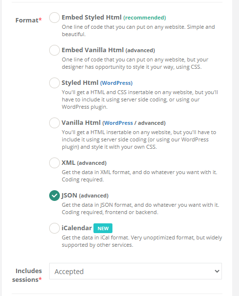
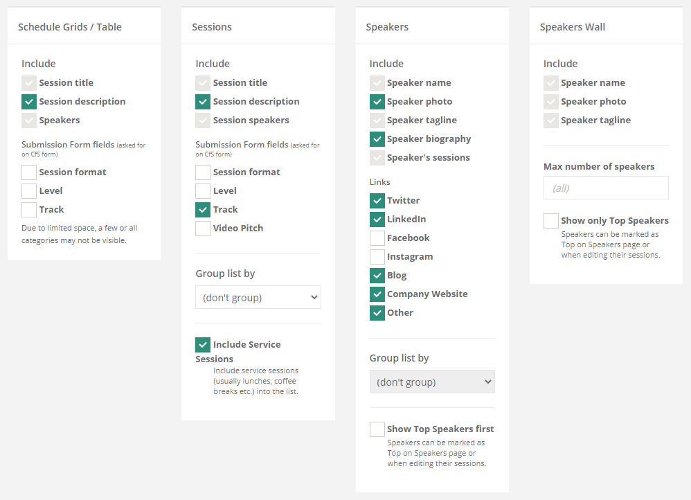

# Static Content Generation via Hexo.io

This site is using [Hexo.io ](https://hexo.io/) to generate static HTML pages.

All work needs to be done in Source. [Travis CI](travis-ci.org) is hooked to Source, runs a build, generates static content, and deploys this content to Master where GitHub pages will serve it.

Hexo is setup to use the templates I've created in themes/stir-trek-comic and then compiles all the files in source/ into those themes. The Speaker and Sponsor data comes from source/_data/ json files.

You'll need Node.js installed to build the site. Then Hexo. Once you have that, in the source branch run:
```javascript
npm install
npm install -g hexo-cli
```

To serve the files locally on port 4000, run:
```javascript
hexo server
```

To generate the static assets in the /public directory, run:
```javascript
hexo generate
```

To deploy, assuming you have the Github token that's used (find it [here](https://travis-ci.org/stirtrek/stirtrek.github.io/settings)) run:
```javascript
hexo deploy
```

## Folders you should care about
`./scripts` - The scripts that hexo runs as part of a build
`./scripts-manuallyexecuting` - This can't be called `./scripts` or Hexo will run it all the time. These are useful helpers for you
`./source` - This is where all of our markdown, styles, and images live
`./source/_data` - Where the data we sync from sessionize (speakers and sessions) or maintain ourselves (sponsors) goes
`./layout` - This is where the Hexo template lives

## How do we get data?
An extract from Sessionize should be saved in _data with the name "sessionsYYYY.json". A new one should be saved each year. The scripts in /script will find those files if they are updated to include the correct years in their years array.

In Sessionize, setup an API / Embed with the following settings:



**Under Advanced Options, choose Include Unscheduled Sessions... when initially publishing if the schedule is not finished**

In _config.yml set the following to put the speakers on the site without a schedule

```javascript
showSchedule: false
showSessionList: true
showSpeakers: true
```

Then go to the Get Code page and copy the URL for this API and paste it in the _config.yml file under `sessionizeApiUrl`.

There's a helpful node script that will download this for you. From the root directory, run `node scripts-manuallyexecuting/download-sessionize-details.js`.  It'll download whatever is at the `sessionizeApiUrl` and save it for you. Commit those changes to upload the speakers.

## How do speaker/session pages get generated?
Files in /scripts get run during a `hexo generate`, reading the data files, creating data for each individual html, and merging them with the appriorate templates. Also, magic.

## How does the schedule get generated
Use the Sessionize schedule builder to layout all the sessions. Add service sessions for breakfast, lunch, the movie, etc. Each session has to be in a room so the service sessions should be in one called "Concourse" or "General".

Do not add the suffix " Room" to the name since the website will do that automatically. Any room named "Virtual" will be treated slightly different on the website and will not include the " Room" suffix.

Once you've downloaded the Sessionize data, you should run `node scripts-manuallyexecuting/build-schedule-from-sessions.js` and then commit the file it creates.

Be sure the publish the schedule on the right side of the Accepted Sessions page.

## How do I change static content?
All of the static pages exist in /source/ as Markdown files. For example:
* If you want to change the homepage, change /source/index.md. 
* The Code of Conduct is /source/info/codeofconduct/index.md.

The look and feel for these pages is driven from JavaScript and HTML stored in /themes/. Don't mess with those if you're not sure what you're doing ;)

If you're new to Markdown, you can find a [simple overview here](https://www.markdownguide.org/basic-syntax/).

## Updating year to year
A few things need to happen to roll the site to a new year:
- _config.yml should be updated with the new year set as currentYear, and added to the allYears array
- _data needs the following to happen:
    - schedule20XX.json needs to be created
    - sponsors20XX.json needs to be created
    - sessions20XX.json needs to be created and then updated from Sessionize once we've selected sessions
    - You can run `node scripts-manuallyexecuting/add-a-new-year 9999` replacing 9999 with the appropriate year to create these files
- Add a folder new folder for speaker photos like /source/images/speakers/YYYY
- Search for the year in the /source directory's .md files and change it where appropriate in content
- While there is no schedule /source/speakers/index.md has the year set as the previous year in the YAML at the top. When we get a new schedule, update this value.

## Creating a speaker archive page
Previous speaker/talk pages get created at /speakers/1234/speaker-Name.html, but there is no automatic archive page. To create one, add a file to /speakers like "2019.md" and update the configuration at the top as appropriate.

The magic behind the speakers pages is that the file in /source/themes/stir-trek-comic/layout/index.ejs magically applies specific themes based on path. And it has a handy regex to match 4 digit year files.

## To add a sponsor
- Add a **(this is important)** 350x200 pixel jpg or png of the sponsor logo to /source/images/sponsors/ folder.
- Copy a sponsor in /source/_data/sponsors.json and paste it in the appropriate year and sponsorship level.
- Commit the change to the Source branch and it should deploy.

## A speaker wants to update their profile, what do I do?
Once a session is submitted on Sessionize, it does not appear that the speaker profile gets any further updates. You will have to edit their profile and then click the "<- Copy" button on the right to update to their global profile.

Don't forget to click "Save Changes"!

Profiles are now pulled from Sessionize via `node scripts-manuallyexecuting/download-sessionize-details.js`. 

Run that script and then use `hexo serve` locally to see the changes. Check in to GitHub and Actions will run `hexo generate` and deploy the site.
